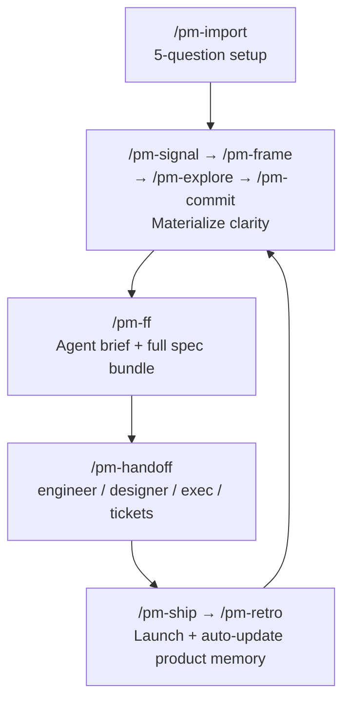

# ProdMan

[](LICENSE)
[](integrations/universal.md)
[](https://claude.ai/code)
[](https://cursor.sh)
[]()

An open-source PM framework for teams building with AI agents — structured thinking, persistent product memory, and agent-ready output from signal to ship.

---

## Quick Start

No prerequisites. Clone and go.

Claude Code gives you native slash commands — but any AI tool works.

### Install

```bash
git clone https://github.com/your-org/prodman.git
cd prodman
```

### 1. Bootstrap your product context

```
/pm-import
```

ProdMan asks 5 targeted questions and generates your `prodman-context/` files automatically. Have existing docs? Paste them at any point to skip ahead.

**What gets created:**
```
prodman-context/
├── product.md       ← what your product is
├── users.md         ← who your users are
├── constraints.md   ← tech, legal, org constraints
└── history.md       ← decisions + retro learnings (grows automatically)
```

### 2. Run your first command

**In Claude Code (VS Code):**
```
/pm-signal Customer support is seeing a spike in "can't find my past orders" tickets
```

**In any other AI tool:**
Open `prodman/commands/pm-signal.md`, paste its contents into your AI chat, then add your signal.

---

No docs? No clarity yet? No problem.

`/pm-import` asks you 5 questions.
Your entire product context is built from your answers.
Start in under 10 minutes.

---

## The Problem

You're building with AI agents. Your workflow looks like this:

- You re-explain your product, users, and constraints to the AI every single session
- You paste a PRD into Claude Code and hope the agent figures out scope
- You write specs in Notion, tickets in Linear, briefs for engineers, 1-pagers for executives — all manually, all for the same feature
- Retro learnings go into a doc nobody reads again
- The next feature starts as cold as the first one

The problem isn't AI capability. It's that nothing connects.

ProdMan connects it.

---

## How It Works

ProdMan is a set of command prompts and context templates. Commands are plain Markdown files — use them as native slash commands in Claude Code, or paste them into any AI tool.

Three ways AI-native PMs work. One framework that connects all three.

| Mode | Commands |
|---|---|
| PM + AI as thinking partner | `/pm-signal` → `/pm-frame` → `/pm-explore` |
| PM + AI as spec writer | `/pm-commit` → `/pm-ff` |
| PM + AI as builder | `/pm-handoff` → `/pm-agent-brief` |



`prodman-context/` persists your product memory across every session. Every command loads it automatically. The more features you ship, the smarter it gets.

### Works With Any AI

Commands live in `prodman/commands/`. Paste any command into Claude, GPT, Gemini, Cursor, or any AI interface. No lock-in.

---

## Why ProdMan vs. just using an LLM

A PM pasting a PRD into Claude Code gets an agent that executes faster.
A PM using ProdMan gets an agent that builds the right thing — with bounded scope, testable criteria, and context it didn't have to be told twice.

| | Direct LLM | ProdMan |
|---|---|---|
| Product context | Re-explained every session | Loaded automatically |
| Problem clarity | Writes what you ask | Questions before speccing |
| Agent handoff | PRD dump, agent guesses at scope | Structured agent brief with explicit out-of-scope and escalation triggers |
| Audience output | One doc, manual reformatting | Five formats from one source |
| Team memory | Dies when the tab closes | Grows with every retro |

---

## Command Reference

### Zone 1 — Materialization
Turn raw signals into clear, committed problem statements. AI asks before it prescribes.

| Command | What it does |
|---|---|
| `/pm-signal` | Capture a raw signal and begin Socratic dialogue |
| `/pm-frame` | Generate 2–3 problem framings to react against |
| `/pm-explore` | Deep-dive a chosen framing — users, behavior, constraints |
| `/pm-commit` | Synthesize into a crisp direction you're committing to |
| `/pm-attach` | Load an image, spreadsheet, PDF, or notes file into context |

### Zone 2 — Planning
Turn a committed direction into a full spec bundle with agent brief as the primary output.

| Command | What it does |
|---|---|
| `/pm-ff` | Generate agent brief + brief + PRD + approach + plan. Prompts for audience view inline. |

### Zone 3 — Research
Support discovery before or alongside spec work.

| Command | What it does |
|---|---|
| `/pm-research` | Interview guides, competitive matrix, prioritization frameworks |

### Zone 4 — Handover
One spec, five audience-ready views. Generate any on demand.

| Command | What it does |
|---|---|
| `/pm-handoff engineer` | User stories, AC, edge cases, open questions — ready for kickoff |
| `/pm-handoff designer` | JTBD, current/target journey, UX constraints |
| `/pm-handoff stakeholder` | Exec 1-pager — outcome-first, no implementation detail |
| `/pm-handoff tickets` | FEAT (SMART) + STORY (agile) — paste into Linear or Jira |
| `/pm-agent-brief` | Standalone agent brief for AI coding agents |

### Zone 5 — Ship & Learn
Coordinate launches and feed learnings back into product memory automatically.

| Command | What it does |
|---|---|
| `/pm-ship` | Launch checklist and communication plan |
| `/pm-retro` | Retrospective — auto-writes learning block to `history.md`, flags context updates |

### Utility

| Command | What it does |
|---|---|
| `/pm-import` | Bootstrap `prodman-context/` via 5-question interview. Paste existing docs to skip ahead. |

---

## Output Layers

`/pm-ff` generates five files to `features/[feature-name]/`. Audience views are on demand.

| Layer | File | Audience | How |
|---|---|---|---|
| **Agent Brief** | `agent-brief.md` | AI coding agents | Always — primary `/pm-ff` output |
| Spec Bundle | `brief.md`, `prd.md`, `approach.md`, `plan.md` | PM reference | Always |
| Engineering Handoff | `handoff-eng.md` | Engineers | `/pm-ff` inline or `/pm-handoff engineer` |
| Design Handoff | `handoff-design.md` | Designers | `/pm-ff` inline or `/pm-handoff designer` |
| Stakeholder Brief | `stakeholder-brief.md` | Leadership | `/pm-ff` inline or `/pm-handoff stakeholder` |
| Ticket Breakdown | `tickets.md` | Linear / Jira | `/pm-handoff tickets` |
| Retrospective | `retro.md` | Team | `/pm-retro` |

---

## Integration Guides

- [VS Code + Claude Code](integrations/vscode-claude.md) — Native slash commands, automatic context loading
- [Cursor](integrations/cursor.md) — Rules file + command workflow
- [Claude Projects](integrations/claude-projects.md) — Project instructions + file uploads
- [Universal (any AI tool)](integrations/universal.md) — Copy-paste workflow for any interface

---

## Philosophy

1. **Materialize clarity before documentation** — Don't write specs for fuzzy problems.
2. **Questioning precedes answering** — ProdMan asks one focused question before it prescribes anything.
3. **Present options, not prescriptions** — Framings and directions are offered, not imposed.
4. **Context-first** — Product memory loads before every response. The AI knows your product.
5. **Immediately actionable output** — Every deliverable is ready to use, not just readable.
6. **Agent-first** — The primary output of every spec is structured for AI coding agents, not human archives. The primary output of `/pm-ff` is not a doc for a human archive — it is a structured context package for an AI agent that is about to build.
7. **AI-agnostic** — Plain Markdown. Works in Claude, GPT, Gemini, Cursor, or any interface.

---

## Roadmap

| Version | Focus | Status |
|---|---|---|
| v0 | Core commands, templates, schemas, integration guides | Done |
| v0.1 | Smart onboarding, living memory, agent-first output, ticket export, audience lenses | Done |
| v0.2 | VS Code extension — ambient context, auto-inject tech context, retro triggers | Planned |
| v0.3 | MCP integration — zero-friction agent handoff from Claude Code | Planned |
| v0.4 | Live integrations — Linear/Jira push, team context sharing | Planned |

---

## Contributing

Contributions are welcome. The bar is: does this make ProdMan more useful for an AI-native PM?

- **New commands** — follow the structure in `prodman/commands/`. One command, one job.
- **Template improvements** — output templates live in `templates/features/`.
- **Integration guides** — new AI tools or IDE setups go in `integrations/`.
- **Bug reports** — open an issue with the command name and what went wrong.

See [CONTRIBUTING.md](CONTRIBUTING.md) for full guidelines.

---

## License

MIT

---

If ProdMan is useful to you, a ⭐ on GitHub helps others find it.
